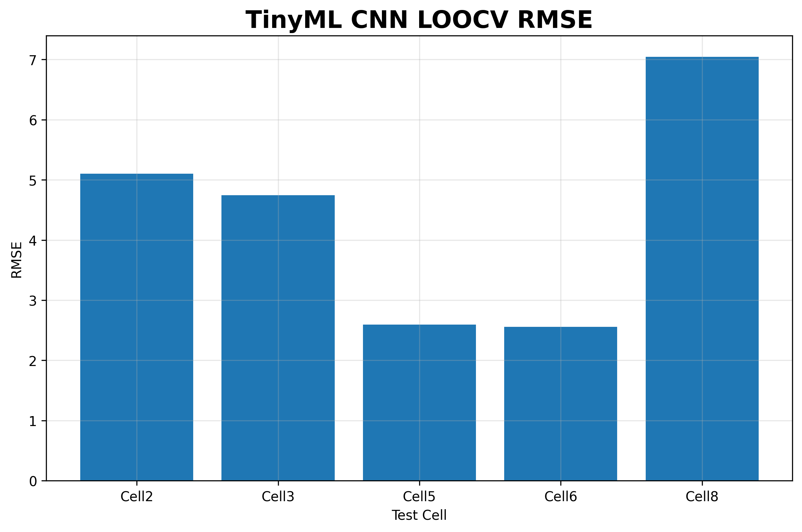
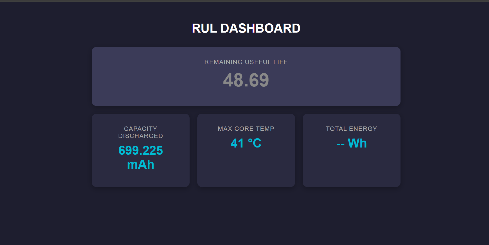

# TinyRUL: An Edge AI Battery Prognostics Using TinyML and FreeRTOS on ESP32

## Overview

TinyRUL is an Edge AI system that performs real-time battery Remaining Useful Life (RUL) estimation directly on an ESP32 microcontroller. The project combines battery degradation feature extraction, a lightweight CNN, TensorFlow Lite Micro deployment, and a FreeRTOS dual-core architecture to enable fully offline battery health monitoring at the edge.

### Key Features

* Oxford Battery Degradation Dataset
* Physics-informed battery health feature extraction
* Lightweight 1D CNN architecture
* Leave-One-Cell-Out Cross Validation (LOOCV)
* PyTorch → ONNX → TensorFlow Lite conversion
* ESP32 deployment using TensorFlow Lite Micro
* FreeRTOS dual-core architecture
* Real-time web dashboard
* Fully offline edge inference

---

# Project Pipeline

```text
Oxford Battery Dataset
        ↓
Dataset Analysis
        ↓
Feature Extraction
        ↓
LOOCV Validation
        ↓
Final Production Training
        ↓
PyTorch Model (.pth)
        ↓
ONNX Export
        ↓
TensorFlow Lite
        ↓
C Header Conversion
        ↓
ESP32 Deployment
```

---

# Dataset

This project uses the Oxford Battery Degradation Dataset containing long-term cycling data collected from lithium-ion battery cells.

### Cells Used

* Cell2
* Cell3
* Cell5
* Cell6
* Cell8

### Raw Signals

For each discharge cycle:

* Voltage (V)
* Charge (Q)
* Temperature (T)
* Time (t)

---

# Dataset Exploration

The first stage of the project focused on understanding battery degradation behaviour through macro and micro-level visualization.


### Macro View

* Capacity fade across battery lifetime
* End-of-Life (EOL) threshold analysis
* Degradation trajectory monitoring

### Micro View

* Voltage discharge dynamics
* Temperature evolution during discharge
* Single-cycle battery behaviour

---

# Feature Engineering

The following degradation features were extracted from each discharge cycle.

| Feature     | Description                            |
| ----------- | -------------------------------------- |
| Capacity    | Delivered discharge capacity           |
| Energy      | Total discharge energy                 |
| Duration    | Discharge duration                     |
| AvgTemp     | Average temperature                    |
| MaxTemp     | Maximum temperature                    |
| VoltageMean | Mean voltage                           |
| VoltageStd  | Voltage standard deviation             |
| dQdVPeak    | Peak differential capacity             |
| dQdVArea    | Area under differential capacity curve |
| Entropy     | Voltage signal entropy                 |

A normalized cycle index was appended during training.

### Total Model Inputs

```text
10 engineered features
+ 1 cycle index
----------------
11 input features
```

---

# Extracted Degradation Features

The extracted features capture electrical, thermal, and electrochemical ageing behaviour.


---

# Feature Correlation Analysis

A correlation matrix was generated to study relationships between battery health indicators and Remaining Useful Life.


---

# Model Architecture

## TinyRUL CNN

```text
Input Shape:
(10 timesteps × 11 features)

Conv1D(11 → 16)
BatchNorm
ReLU

Conv1D(16 → 32)
BatchNorm
ReLU

Global Average Pooling

Linear(32 → 32)
ReLU
Dropout(0.2)

Linear(32 → 16)
ReLU

Linear(16 → 1)

Output:
Remaining Useful Life
```

### Training Configuration

| Parameter     | Value      |
| ------------- | ---------- |
| Epochs        | 80         |
| Batch Size    | 16         |
| Optimizer     | Adam       |
| Learning Rate | 0.001      |
| Loss Function | Huber Loss |

---

# Validation Strategy

## Leave-One-Cell-Out Cross Validation (LOOCV)

To evaluate generalization capability, Leave-One-Cell-Out Cross Validation was performed.

For every fold:

```text
Train: Cell2 Cell3 Cell5 Cell6
Test : Cell8

Train: Cell2 Cell3 Cell5 Cell8
Test : Cell6

...
```

This ensures that the model is evaluated on entirely unseen battery cells.

---

# LOOCV Results



Detailed fold-by-fold results are available in:

```text
LOOCV_Validation/TinyML_LOOCV_Results.csv
```

---

# Model Export Pipeline

The trained PyTorch model was exported through a multi-stage TinyML deployment pipeline:

```text
PyTorch (.pth)
      ↓
ONNX
      ↓
TensorFlow Lite
      ↓
TensorFlow Lite Micro
      ↓
C Header (model_finalVersion.h)
      ↓
ESP32
```

This pipeline enables the neural network to run entirely on-device without requiring cloud connectivity.

---

# System Architecture: FreeRTOS Dual-Core Integration

Deploying a neural network alongside a live telemetry stream and a responsive web dashboard on a resource-constrained microcontroller introduces significant scheduling and memory challenges.

To ensure stable operation, the firmware was architected using FreeRTOS and the ESP32's dual-core architecture.

### Core 1 — I/O & Web Server

Dedicated to:

* Continuous 115200 baud UART telemetry reception
* Asynchronous web server
* AJAX dashboard updates
* Non-blocking network communication

### Core 0 — AI Inference Engine

Dedicated to:

* Feature extraction
* Sequence buffer management
* TensorFlow Lite inference
* RUL prediction generation

### Synchronization Strategy

```text
UART Stream
      ↓
Sequence Buffer
      ↓
Semaphore Trigger
      ↓
Core 0 Wake-Up
      ↓
Feature Extraction
      ↓
TinyRUL CNN Inference
      ↓
Prediction Result
      ↓
Dashboard Update
```

This separation completely isolates communication tasks from neural network computation, preventing packet loss, dropped connections, and inference-related blocking.

---

# TinyML Constraints & Performance

## Embedded Metrics

| Metric                 | Value              |
| ---------------------- | ------------------ |
| Inference Latency      | ~15 ms             |
| Flash Memory Footprint | ~19 KB             |
| SRAM Allocation        | 10 KB Tensor Arena |

### Deployment Target

```text
ESP32
```

### Inference Engine

```text
TensorFlow Lite Micro
```

---

# Real-Time Dashboard

The ESP32 serves a live battery-health dashboard showing telemetry and Remaining Useful Life predictions.



### Example Output

```text
Predicted RUL : 48.69 cycles

Capacity Discharged : 699.225 mAh

Maximum Core Temperature : 41°C
```

---

# How To Run

## 1. Train the Model

```bash
python train_tinyrul_cnn.py
```

Output:

```text
FINAL_PRODUCTION_TINYML.pth
```

---

## 2. Run LOOCV Validation

```bash
python LOOCV.ipynb
```

Outputs:

```text
TinyML_LOOCV_Results.csv
Tiny_RMSE_Barplot.png
```

---

## 3. Export for TinyML

```bash
python export_tflite.py
```

Outputs:

```text
tiny_rulfixed.onnx
model_finalVersion.h
```

---

## 4. Deploy on ESP32

1. Open Arduino IDE
2. Install ESP32 board package
3. Install TensorFlow Lite Micro library
4. Open:

```text
esp32_deployment/main.cpp
```

5. Connect ESP32
6. Upload firmware
7. Open dashboard or Serial Monitor

---

# Repository Structure

```text
.
├── dataset_analysis
│   ├── data_visualisation.m
│   └── Feature_Extraction.m
│
├── LOOCV_Validation
│   ├── LOOCV.ipynb
│   └── TinyML_LOOCV_Results.csv
│
├── Training
│   ├── train_tinyrul_cnn.py
│   └── export_tflite.py
│
├── esp32_deployment
│   ├── main.cpp
│   └── model_finalVersion.h
│
├── images
│   ├── Datasetv visualisation.png
│   ├── Degradation Features.png
│   ├── Feature Correlation Matrix.png
│   └── Tiny_RMSE_Barplot.png
│
├── dashboard.png
│
└── README.md
```

---

# Technologies Used

* MATLAB
* Python
* PyTorch
* NumPy
* SciPy
* Scikit-Learn
* ONNX
* TensorFlow Lite
* TensorFlow Lite Micro
* ESP32
* FreeRTOS

---

# Future Work

* INT8 quantized deployment
* Multi-cell battery pack prediction
* Battery Management System integration
* Transformer-based RUL estimation
* ARM Cortex-M deployment

---

# Author

**Aditya Kumar.**

Electronics and Communication Engineering (ECE)

## License

This project is licensed under the MIT License - see the LICENSE file for details.


